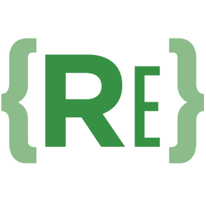

  

# REPlexus Revenue Engineering Framework
**The Open-Core Skill Library for Agentic Revenue Engineering**

**Framework Author:** [Josh Rosenthal](https://linkedin.com/in/citizen) on behalf of REPlexus.com
**Version:** 1.0.0 | **License:** REPlexus Community License v1.0

---

## The Vision: Transition Customer Success from a cost center to a high-precision Revenue Engineering function through autonomous agents and codified playbooks.

**REPlexus** is a sovereign library of **specialized AI Skills** designed to move Customer Success from "Reactive Support" to "Proactive Revenue Engineering." These skills are written to be read by humans and executed by autonomous agents (Gemini, Claude, etc.).

## Key Pillars of the Framework
1. **Technical Integrity:** Moving beyond basic CRM notes to multi-protocol schema alignment (gRPC, OpenAPI).
2. **Outcome Intent:** Codifying exactly what the customer wants to achieve from Day 0.
3. **Value Receipts:** Automating the evidence of ROI for CFO-level reviews.
4. **Predictive Save-Plays:** Using neural telemetry to identify and stop churn 90 days in advance.

## How to Use This Library
* **For CSMs:** Use the [Web Portal](https://your-app-url.com) to browse Save Plays and Expansion Blueprints.
* **For Engineers:** Plug the `/skills-library` folder into your AI Agents or MCP servers to provide real-time customer logic.
* **For AI Agents:** Use the `.md` files as system prompts for autonomous Customer Success tasks.

## Contributing
We are an open-core project. We welcome contributions from the global Customer Success community. If you have a specific Save Play or Onboarding Blueprint, please see `CONTRIBUTING.md` to learn how to contribute while maintaining your professional attribution.

---

# LICENSE & ATTRIBUTION
(c) 2026 REPlexus LLC. 

Licensed under the **REPlexus Community License v1.0**.  
**Personal & Internal Business Use permitted. Commercial Consulting prohibited.**

For full legal terms, including our hardened limitation of liability regarding AI hallucinations and financial loss, please see [LICENSE.md](/LICENSE.md).